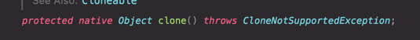

# 13. clone 재정의는 주의해서 진행하라

Cloneable은 복제해도 되는 클래스임을 명시하는 용도인 믹스인 인터페이스(mixin interface, 아이템20)지만,
아쉽게도 의도한 목적을 제대로 이루지 못했다.

가장 큰 문제는 clone 메서드가 선언된 곳이 Cloneable이 아닌 Object이고, 그 마저도 protected라는 데 있다.
그래서 단순히 Cloneable을 구현하는 것만으로는 외부 객체에서 clone 메서드를 호출할 수 없다.   

>해당 객체가 접근이 허용된 clone 메서드를 제공한다는 보장이 없기 때문

아래는 Object의 clone 메서드


이런 문제점들이 있음에도 Cloneable 방식은 널리 쓰이고 있어서 알아두는 것이 좋다.

이번 '아이템.13' 에서는 다음과 같은것을 정리한다.
* clone 메서드를 잘 동작하게끔 해주는 구현 방법
* 언제 그렇게 해야 하는지
* 가능한 다른 선택지

### 메서드 하나 없는 Cloneable 인터페이스는 무슨 일을 할까?

이 인터페이스는 Object의 protected 메서드인 clone의 동작 방식을 결정한다.   
Cloneable을 구현한 클래스의 인스턴스에서 clone 메서드를 호출하면 그 객체의 필드들을 하나하나 복사한 객체를 반환하며, 
그렇지 않은 클래스의 인스턴스에서 호출하면 CloneNotSupportedException을 던진다.

이런 구현은 인터페이스를 상당히 이례적으로 구현한 것이므로 따라하지 말아야한다.   

> 인터페이스를 구현한다는 것은 일반적으로 해당 클래스가 그 인터페이스에서 정의한 기능을 제공한다고 선언하는 행위   
> 하지만 Cloneable은 상위 클래스에 정의된 protected 메서드의 동작 방식을 변경한 것이다.   
> Object는 모든 클래스의 상위 클래스이다. 하위 클래스인 Cloneable이 Object의 동작을 변경하는것은 옳지않다.

명세에는 없지만 실무에서 Cloneable을 구현한 클래스는 clone 메서드를 public으로 제공하며, 사용자는 당연히 복제가 제대로 이뤄지리라 기대한다.   

이 기대를 만족시키려면 해당 클래스와 모든 상위 클래스는 복잡하고, 
강제할 수 없고, 허술하게 기술된 프로토콜을 지켜야만 한다. 
그 결과로 깨지기 쉽고, 위험하고, 모순적인 매커니즘이 탄생한다.

> clone 메서드를 통해 생성자를 호출하지 않고도 객체를 생성할 수 있게 되는 모순적인 매커니즘이 탄생!
 
### clone 메서드의 허술한 일반 규약

다음은 Object 명세에 있는 설명이다.

> 이 객체의 복사본을 생성해 반환한다. '복사'의 정확한 뜻은 그 객체를 구현한 클래스에 따라 다를 수 있다.   
> 일반적인 의도는 어떤 객체 x에 대해 x.clone으로 복사한 객체는 참조값이 같지않다는 결과가 나오는 것이다.   
> x.clone() != x // true
> 
> 또한 x.clone으로 복사한 객체는 x와 같은 클래스를 가진다.
> x.clone().getClass() == x.getClass() // true
> 
> 하지만 위의 요구를 반드시 만족해야 하는 것은 아니다.
> 
> x.clone().equals(x) 도 일반적으로 참이지만, 역시 필수는 아니다.
> 
> 관례상, clone 메서드가 반환하는 객체는 super.clone을 호출해 얻어야한다.   
> 이 클래스와(Object를 제외한) 모든 상위 클래스가 이 관례를 따른다면 다음 식은 참이다.
> x.clone().getClass() == x.getClass()
> 
> 관례상, 반환된 객체와 원본 객체는 독립적이어야 한다. 
> 이를 만족하려면 super.clone으로 얻은 객체의 필드 중 하나 이상을 반환 전에 수정해야 할 수도 있다.

강제성이 없다는 점만 때면 생성자 연쇄(constructor chaining)와 살짝 비슷한 매커니즘이다.   
clone 메서드가 super.clone이 아닌, 생성자를 호출해 얻은 인스턴스를 반환해도 컴파일러는 불평하지 않는다.

```java
@Override
public Object clone() {
    return new Something();    
}
```

문제는 상위 클래스의 clone 메서드는 생성자를 호출해 반환하도록 했는데   
하위 클래스에서 super.clone을 호출했을 때 문제가 발생한다.

```java
@Override
public Object clone() {
    return new Something();    
}

// Something 클래스를 상속한 하위 클래스
@Override
public Object clone() {
    return super.clone();
}
```

CloneExample2 클래스를 참고

위의 구현대로하면 super.clone을 호출했을 때 호출한 객체의 타입을 가진 복사본을 얻을 수 없게된다.   
(clone 호출 시 예외가 발생!!)   
하위 클래스에서 super.clone을 호출했을 때 상위클래스에서는 생성자를 통해 반환하기 때문에 상위 타입을 가진 객체가 반환된다.

> clone을 재정의한 클래스가 final이라면 걱정해야 할 하위 클래스가 없으니 이 관례는 무시해도 한전하다.

클래드에 정의된 모든 필드가 기본 타입이거나 불변 객체를 참조한다면 super.clone 호출 시 우리가 원하는 상태일 것이다.

그런데 쓸데없는 복사를 지양한다는 관점에서 보면 불변 클래스는 굳이 clone 메서드를 제공하지 않는 게 좋다.

```java
// Something 클래스의 clone 메서드 재정의
@Override
public Something clone() {
    try {
        return (Something) super.clone();
    } catch(CloneNotSupportedException e) {
        throw new AssertionError(); 
    }
}
```

Object의 clone 메서드는 Object타입을 반환하지만 Something의 clone 메서드는 Something 타입의 객체를 반환한다.
> 이것은 자바가 공변 반환 타이핑을 지원해서 가능한 것이다.   
> 이렇게 함으로써 클라이언트가 이 메서드를 호출했을 때 타입 변환을 신경쓰지 않도록 해주자!

try-catch 블록으로 감싸서 CloneNotSupportedException 검사 예외(checked-exception)를 비검사 예외(unchecked-exception)를 던지도록 구현했다.   
이것은 CloneNotSupportedException 예외가 사실 unchecked-exception였어야 했다는 신호다.

### 가변 객체의 clone 메서드 재정의

앞서 간단했던 clone 메서드 재정의가 가변 객체에 적용하려면 상당히 어려워진다.

```java
class Stack implements Cloneable {
    
    private static final int DEFAULT_INITIAL_CAPACITY = 16;
    
    private Object[] elements;
    private int size = 0;
    
    public Stack() {
        this.elements = new Object[DEFAULT_INITIAL_CAPACITY];
    }
    
    @Override
    public Stack clone() {
        return super.clone();
    }
}
```

위의 Stack 클래스를 복제하기 위해 재정의한 clone 메서드가 단순히 super.clone을 호출하면 어떤일이 벌어질까?
* size는 정상적으로 복사된다. (기본값 타입)
* Object 배열인 elements는 배열 객체의 참조값은 변경되지만 배열 내부의 값들은 복사되지 않고 원본의 참조값을 가지고 있을 것이다.
  * 즉, 복사된 Stack 객체의 elements 배열의 내부 값을 수정하면 원본 객체의 배열 내부 값도 수정된다.

> clone 메서드는 사실상 생성자와 같은 효과를 낸다.   
> 즉, clone은 원본 객체에 아무런 해를 끼치지 않는 동시에 복제된 객체의 불변식을 보장해야한다.

Stack의 clone이 제대로 동작하려면 elements 배열의 clone을 재귀적으로 호출하는 방법이 있다.
가변 상태를 참조하는 클래스용 clone 메서드

```java
    @Override
    public Stack clone() {
        try {
            Stack result = (Stack) super.clone();
            result.elements = elements.clone();
            return result;
        } catch (CloneNotSupportedException e) {
            throw new AssertionError();
        }
    }
```

> 위 예제에서 elements.clone의 결과를 Object[]로 형변환할 필요는 없다.   
> 배열의 clone은 런타임 타입과 컴파일타임 타입 모두가 원본 배열과 똑같은 배열을 반환한다.   
> 따라서 배열을 복제할 때는 배열의 clone 메서드를 사용하라고 권장한다.   
> **사실 배열은 clone 기능을 제대로 사용하는 유일한 예라고 할 수 있다.**

clone을 재귀적으로 호출하는 것만으로 충분하지 않을 때도 있다.

```java
public class HashTable implements Cloneable {
    private Entry[] buckets = ...;
    
    private static class Entry {
        final Object key;
        Object value;
        Entry next;
        
        Entry(Object key, Object value, Entry next) {
            this.key = key;
            this.value = value;
            this.next = next;
        }
    }
}
```

이 해쉬테이블을 Stack에서 처럼 배열에 clone을 재귀적으로 호출한다면

```java
    @Override
    public HashTable clone() {
        try {
            HashTable result = (HashTable) super.clone();
            result.buckets = buckets.clone();
            return result;
        } catch (CloneNotSupportedException e) {
            throw new AssertionError();
        }
    }
```

복제본은 자신만의 버킷 배열을 갖지만, 이 배열은 원본과 같은 연결리스트를 참조하여 원본과 복제본 모두에게 예기치 않게 동작할 가능성이 생긴다.

이를 해결하기 위해 각 버킷을 구성하는 연결리스트도 복사해야한다.

```java
    private static class Entry {
        final Object key;
        Object value;
        Entry next;
      
        Entry(Object key, Object value, Entry next) {
          this.key = key;
          this.value = value;
          this.next = next;
        }
        
        Entry deepCopy() {
            return new Entry(key, value, next == null ? null : next.deepCopy());
        }
    }

    @Override
    public HashTable clone() {
        try {
            HashTable result = (HashTable) super.clone();
            result.buckets = new Entry[buckeys.length];
            for (int i = 0; i < buckets.length; i++)
                if (buckets[i] != null)
                        result.buckets[i] = buckets[i].deepCopy(); 
            return result;
        } catch (CloneNotSupportedException e) {
            throw new AssertionError();
        }
    }
```

HashTable에 깊은 복사를 지원하도록 추가했다.
deepCopy 메서드는 자신이 가리키는 연결 리스트 전체를 복사하기 위해 자신을 재귀적으로 호출한다.

위 방법은 간단하고 버킷이 길지 않다면 잘 동작한다.   
하지만 리스트가 길면 스택오버 플로가 발생할 위험이 있다.   
이 문제를 피하려면 deepCopy를 재귀 호출 대신 반복자를 써서 순회하는 방향으로 수정해야한다.

```java
Entry deepCopy() {
    Entry result = new Entry(key, value, next);
    for (Entry p = result; p.next != null; p = p.next) {
        p.next = new Entry(p.next.key, p.next.value, p.next.next);    
    }
    return result;
}
```

### Cloneable 방식을 막는 방법

상속해서 쓰기위한 클래스 설계 방식 두 가지(아이템 19) 중 어느 쪽에서든, 상속용 클래스는 Cloneable을 구현해서는 안 된다.   
clone을 동작하지 않게 구현해놓고 하위 클래스에서 재정의하지 못하게 할 수 있다.

```java
@Override
protected final Object clone() CloneNotSupportedException {
    throw new CloneNotSupportedException();
}
```

### 객체 복사를 위한 다른 방법

복사 생성자와 복사 팩터리 라는 더 나은 객체 복사 방식을 제공할 수 있다.

```java
// 복사 생성자
public Yum(Yum yum) {
    return ...
}

// 복사 팩터리
public static Yum newInstance(Yum yum) {
    return ...
}
```

복사 생성자와 그 변형인 복사 팩터리는 Cloneable/clone 방식보다 나은점이 많다.
* 언어 모순적이고 위험천만한 객체 생성 매커니즘(생성자를 쓰지 않는 방식)을 사용하지 않음
* 엉성하게 문서화된 규약에 기대지 않음
* 정상적인 필드 용법과도 충돌하지 않음
* 불필요한 검사 예외를 던지지 않음
* 형변환 필요하지 않음
* 인터페이스 타입의 인스턴스를 인수로 받을 수 있다.

인터페이스 기반 복사 생성자와 복사 팩터리의 더 정확한 이름은 '변환 생성자', '변환 팩터리'이다.   
이들을 이용하면 클라이언트 원본의 구현 타입에 얽매이지 않고 복제본의 타입을 직접 선택할 수 있다.

```java
Set<Object> s = new HashSet<>();

Set<Object> treeSet = new TreeSet<>(s);
```

