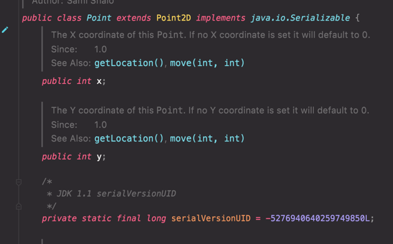

# 아이템16. public 클래스에서는 public 필드가 아닌 접근자 메서드를 사용하라

이따금 인스턴스 필드들만 모아놓는 일 외에는 아무 목적도 없는 퇴보한 클래스를 작성하려고 할 때가 있다.

```java
public class Point {
    public double x;
    public double y;
}
```

이 클래스의 필드 x,y는 외부에서도 접근하고 수정할 수 있다.   
접근 제한자가 public 이기 때문이다.

이는 **캡슐화**의 이점을 제공하지 못하는 클래스이다.

> API를 수정하지 않고는 내부 표현을 바꿀 수 없고, 불변식을 보장할 수 없으며, 외부에서 필드에 접근할 때 부수 작업을 수행할 수도 없다.

객체지향을 지킨다면 필드의 접근 제한자를 private으로 선언하고 접근자 메서드를 추가하자(Getter).

```java
public class Point {
    private double x;
    private double y;
    
    public double getX() {
        return this.x;
    }
    
    public double getY() {
        return this.y;
    }
}
```

public 클래스에서라면 위의 방식이 확실히 맞다. 
패키지 바깥에서 접근할 수 있는 클래스라면 접근자를 제공함으로써 클래스 내부 표현방식을 언제든 바꿀 수 있는 유연성을 얻을 수 있다.

### package-private 클래스 혹은 private 중첩 클래스 에서의 public 필드

package-private 클래스 혹은 private 중첩 클래스라면 데이터 필드를 노출한다 해도 위에서 말한 문제가 없다.   
이렇게 하면 클래스 선언 면에서나 이를 사용하는 클라이언트 코드 면에서나 접근자 방식보다 훨씬 깔끔하다.

만약 변경이 생기더라도 패키지 바깥의 코드는 변경이 없고 내부의 데이터 표현 방식만 변경해주면 된다.   
private 중첩 클래스의 경우에는 그 클래스를 포함하는 바깥 클래스에만 수정의 영향을 끼친다.

```그 클래스가 표현하려는 추상 개념만 올바르게 표현해주면 된다.```

```java
public class Example1 {
    
    private static class PrivateInnerClass {
         public int a;
         public int b;
    }
}

class PackagePrivateClass {
    public int a;
    public int b;
}
```

자바 라이브러리에도 public 클래스의 필드를 직접 노출하지 말라는 규칙을 어기는 사례가 종종 있다.
* java.awt.package의 Point 와 Dimension 클래스



> 필드의 접근제한자가 public 이다.

이 클래스들은 흉내내려 하지말고 잘못된 예시로 봐야한다.

### public 클래스의 public 필드가 불변성이라면

public 필드가 불변이라면 직접 노출할 때의 단점이 조금은 줄어들지만, 결코 좋은 생각은 아니다.

```java
public final class Time {
    public final int hour;
    public final int minute;
}
```

API를 변경하지 않고는 표현 방식을 바꿀 수 없고, 필드를 읽을 때 부수 작업을 수행할 수 없다는 단점은 여전하다.

> 핵심 정리   
> * public 클래스는 절대 가변 필드를 직접 노출해서는 안 된다.
> * 불변 필드라면 노출해도 덜 위험하지만 안심할 수 없다.
> * package-private 클래스나 private 중첩클래스에서는 종종 (불변이든 가변이든) 노출하는 편이 나을 때도 있다.