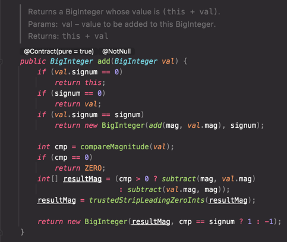

# 아이템17. 변경 가능성을 최소화하라

불변 클래스란?

인스턴스 내부의 값을 수정할 수 없는 클래스.

불변 인스턴스에 간직된 정보는 고정되어 객체가 파괴되는 순간까지 절대 달라지지 않는다.   
자바 플랫폼 라이브러리에도 다양한 불변 클래스가 있다.
* String
* 기본 타입의 박싱된 클래스들 ex) Integer, Double ...
* BigInteger, BigDecimal

불변 클래스는 가변 클래스보다 설계하고 구현하고 사용하기 쉬우며, 오류가 생길 여지도 적도 훨씬 안전하다.

클래스를 불변으로 만들려면 다음 다섯 가지 규칙을 따르면 된다.
* 객체의 상태를 변경하는 메서드(변경자)를 제공하지 않는다.
* 클래스를 확장할 수 없도록 한다. 
  * 하위 클래스에서 부주의하게 혹은 나쁜 의도로 객체의 상태를 변하게 만드는 사태를 막아준다.
  * 상속을 막는 방법으로 간단하게 final 클래스를 선언하는 방법이 있고, 정적 팩터리 메서드를 활용하는 방법이 있다.(뒤에서 설명)
* 모든 필드를 private으로 선언한다.
  * 필드가 참조하는 가변 객체를 클라이언트에서 직접 접근해 수정하는 일을 막아준다.
  * 기본 타입 필드, 불변 객체를 참조하는 필드를 public final로만 선언해도 불변 객체가 되지만, 이렇게 하면 다음 릴리스에서 내부 표현을 바꾸지 못하므로 권하지 않는다.
* 자신 외에는 내부의 가변 컴포넌트에 접근할 수 없도록 한다.
  * 클래스에 가변 객체를 참조하는 필드가 하나라도 있다면 클라이언트에서 그 객체의 참조를 얻을 수 없도록 해야 한다.
  * 이런 필드는 절대 클라이언트가 제공한 객체 참조를 가리키게 해서는 안되며, 접근자 메서드가 그 필드를 그대로 반환하게 두어서도 안된다. 생성자, 접근자, readObject 메서드 모두에서 **방어적 복사**를 수행하라
  
아래는 돈을 나타내는 값 클래스입니다.

```java
public class Money {
    
    private final int value;

    public Money(int value) {
        this.value = value;
    }
    
    public Money plus(Money m) {
        return new Money(this.value + m.value);
    }
    
    public Money minus(Money m) {
        return new Money(this.value - m.value);
    }

    public Money times(Money m) {
        return new Money(this.value * m.value);
    }

    public Money dividedBy(Money m) {
        return new Money(this.value / m.value);
    }

    public int value() {
        return value;
    }

    @Override
    public boolean equals(Object o) {
        if (this == o) return true;
        if (o == null || getClass() != o.getClass()) return false;
        Money money = (Money) o;
        return value == money.value;
    }

    @Override
    public int hashCode() {
        return Objects.hash(value);
    }

    @Override
    public String toString() {
        return "Money{" +
                "value=" + value +
                '}';
    }
}
```

돈이라는 값을 반환하는 접근자 메서드(value)와 사칙연산 메서드(plus, minus, times, dividedBy)를 정의했다.

이 사칙연산 메서드들이 인스턴스 자신은 수정하지 않고 새로운 Complex 인스턴스를 만들어 반환하는 모습에 주목해야한다.   
이처럼 피연산자에 함수를 적용해 그 결과를 반환하지만, 피연산자 자체는 그대로인 프로그래밍 패턴을 함수형 프로그래밍 이라고 한다.

```java
public Money plus(Money m) {
    return new Money(this.value + m.value);
}
```

이와 달리 절자적, 혹은 명령형 프로그래밍 에서는 메서드에서 피연산자인 자신을 수정해 자신의 상태가 변하게 한다.

```java
// Money의 value 필드가 불변이 아닐 떄
public Money plus(Money m) {
    this.value = this.value + m.value;
    return this;
}
```

메서드 이름으로 'add' 같은 동사 대신 'plus' 같은 전치사를 사용한 점에도 주목하자.

> 이는 해당 메서드가 객체의 값을 변경하지 않는다는 사실을 강조하려는 의도이다.

참고로 이 명명 규칙을 따르지 않은 BigInteger와 BigDecimal 클래스를 사람들이 잘못 사용해 오류가 발생하는 일이 자주 있다.



연산을 수행했을 때 피연산자는 그대로인 방식으로 프로그래밍하면 코드에서 불변이 되는 영역의 비율이 높아지는 장점을 누릴 수 있다.

> 불변 객체는 단순하다.   
> 불변 객체는 생성된 시점의 상태를 파괴될 때까지 그대로 간직한다.

모든 생성자가 클래스 불변식(class invariant)을 보장한다면 그 클래스를 사용하는 프로그래머가 다른 노력을 들이지 않더라도 영원히 불변으로 남는다.

반면 가변 객체는 임의로 복잡한 생태에 놓일 수 있다. (자신의 의도하지 않은 상태로 객체가 변할 수 있다.)
변경자 메서드가 일으키는 상태 전이를 정밀하게 문서로 남겨놓지 않은 가변 클래스는 믿고 사용하기 어려울 수도 있다.

### 불변 객체는 Thread-safe하다.

불변 객체는 근본적으로 스레드 안적하여 따로 동기화할 필요가 없다.

> 여러 스레드가 동시에 사용해도 절대 훼손되지 않는다.

불변 객체에 대해서는 그 어떤 스레드도 다른 스레드에 영향을 줄 수 없으니 불변 객체는 안심하고 공유할 수 있다.

이 말은 불변 클래스라면 한번 만든 인스턴스를 최대한 재활용할 수 있다는 것이다.   
가장 쉬운 재활용 방법은 자주 쓰이는 값들을 상수(public static final)로 제공하는 것이다.

```java
public static final Money ZERO = new Money(0);
public static final Money ONE_HUNDRED = new Money(100);
```

한걸음 더 나아가 불변 클래스는 자주 사용되는 인스턴스를 캐싱하여 같은 인스턴스를 중복 생성하지 않게 해주는 정적 팩터리(아이템1)를 제공할 수 있다.

박싱된 기본 타입 클래스 전부와 BigInteger가 여기 속한다.   
정적 팩터리를 사용하면 여러 클라이언트가 인스턴스를 공유하여 메모리 사용량과 가비지 컬렉션의 비용이 줄어든다.

> 불변 객체를 자유롭게 공유할 수 있다는 점은 방어적 복사도 필요없다는 결론으로 자연스럽게 이어진다.   
> 아무리 복사해봐야 원본과 똑같으니 복사 자체가 의미가 없다.   
> 불변 클래스는 clone 메서드나 복사 생성자를 제공하지 않는 게 좋다.   
> String 클래스의 복사 생성자는 이 사실을 잘 이해하지 못한 자바 초창기 때 만들어진 것으로, 되도록 사용하지 말아야한다.

### 불변 객체끼리는 내부 데이터를 공유할 수 있다.

불변 객체는 자유롭게 공유가 가능하므로 불변 객체 끼리 내부 데이터를 공유할 수 있다.

불변 객체의 배열인 필드를 가진다고 하면, 배열은 비록 가변이지만 복사하지 않고 원본 인스턴스와 공유해도 된다.
내부에 변경을 위한 메서드가 없기때문에 변경하지 않음을 보장하기 때문이다.

### 객체를 만들 때 다른 불변 객체들을 구성요소로 사용하면 이점이 많다.

값이 바뀌지 않는 구성요소들로 이뤄진 객체라면 그 구조가 아무리 복잡하더라도 불변식을 유지하기 훨씬 쉽고 간편하기 때문이다.

좋은 예로, 불변 객체는 맵의 키와 집합(Set)의 원소로 쓰기에 안성맞춤이다. 맵이나 집합은 안에 담긴 값이 바뀌면 불변식이 허물어지는데, 불변 객체를 사용하면 그런 걱정은 하지 않아도 된다.

### 불변 객체는 그 자체로 실패 원자성을 제공한다.

실패 원자성이란?   
'메서드에서 예외가 발생한 후에도 그 객체는 여전히 (메서드 호출 전과 똑같은) 유효한 상태여야 한다'는 성질이다.
불변 객체의 메서드는 내부 상태를 바꾸지 않으니 이 성질을 만족한다.

### 불변 클래스의 단점

값이 다르면 반드시 독립된 객체로 만들어야 한다는 것

예를들어 100개의 요소중 하나의 상태만 변경하려 해도 전체의 요소를 새로운 객체로 만들어야한다.

### 불변 클래스임을 보장하기 위해 자신을 상속하지 못하게 하는 방법

가장 쉬운 방법으로 final 클래스로 선언하는 방법이 있다.

이것 보다 더 유연한 방법이 있다.

모든 생성자를 private 혹은 package-private으로 만들고 public 정적 팩터리를 제공하는 방법이다.

```java
public class Money2 {
    
    private final int value;

    private Money2(int value) {
        this.value = value;
    }
    
    public static Money2 valueOf(int value) {
        return new Money2(value);
    }
}
/*
공개된 생성자가 없으므로 상속해도 사용할 수 없다.
class Won extends Money2 {
}
*/
```

이 방식이 최선일 때가 많다. 바깥에서 볼 수 없는 package-private 구현 클래스를 원하는 만큼 만들어 활용할 수 있으니 훨씬 유연하다.

패키지 바깥의 클라이언트에서 바라본 이 불변 객체는 사실상 final이다.   
public 이나 protected 생성자가 없으니 다른 패키지에서는 이 클래스를 확장하는 게 불가능하기 때문이다.

> 정적 팩터리 방식은 다수의 구현 클래스를 활용한 유연성을 제공하고, 이에 더해 다음 릴리스에서 객체 캐싱 기능을 추가해 성능을 끌어올릴 수도 있다.

### 자바에서의 실수
BigInteger와 BigDecimal을 설계할 당시엔 불변 객체가 사실상 final 이어야 한다는 생각이 널리 퍼지지않았다.

그래서 이 두 클래스의 메서드들은 모두 재정의할 수 있게 설계되었고, 안타깝게도 하위 호환성이 발목을 잡아 지금까지도 이 문제를 고치지 못했다.

만약 신뢰할 수 없는 클라이언트로부터 BigInteger나 BigDecimal의 인스턴스를 인수로 받는다면 주의해야 한다.   
해당 객체가 진짜 BigInteger(또는 BigDecimal)인지 확인해야한다. 

> BigInteger를 상속하고 재정의한 무언가라면 해당 객체는 가변 객체라 생각하고 방어적으로 복사해서 사용해야한다.

```java
public static BigInteger safeInstance(BigInteger val) {
    return val.getClass() == BigInteger.class ?
        val : new BigInteger(val.toByteArray());
}
```

이번 아이템 초입에서 나열한 불변 클래스의 규칙 목록에 따르면 ```모든 필드가 final이고 어떤 메서드도 그 객체를 수정할 수 없어야 한다.```

사실 이 규칙은 좀 과한 느낌이 있어서, 성능을 위해 다음처럼 살짝 완화할 수 있다.

"어떤 메서드도 객체의 상태 중 외부에 비치는 값을 변경할 수 없다."

어떤 불변 클래스는 계산 비용이 큰 값을 나중에(처음 쓰일 때) 계산하여 final이 아닌 필드에 캐시 해놓기도 한다.

```java
import java.util.Objects;

public final class Money {
  private Integer somethingCache;

  public int calc() {
    if (Objects.isNull(this.somethingCache)) {
        int result = 0;
        비용이 큰 계산 ...
        this.somethingCache = result;
    }
    return this.somethingCache;
  }
} 
```

똑같은 값을 다시 요청하면 캐시해둔 값을 반환하여 계산 비용을 절감하는 것이다.

이런 방식은 해당 객체가 불변이기 때문에 부릴 수 있는 묘수이다. 몇 번을 계싼해도 항상 같은 결과가 만들어짐이 보장되기 때문이다. (내부 상태가 변하지 않기 때문에 계산 결과는 항상 동일하다.)

### 정리
* Getter가 있다고 해서 항상 Setter를 만들지는 말자. 클래스는 꼭 필요한 경우가 아니라면 불변이어야한다.
* 불변 클래스는 장점이 많으며 단점이라고는 특정 상황에서의 잠재적 성능 저하 뿐이다.
* Money같은 단순한 값 객체는 항상 불변으로 만들자
* String과 BigInteger같은 무거운 값 객체는 불변으로 만들 수 있는지 고심해야 한다.
  * 성능 때문에 어쩔 수 없다면 불변 클래스와 쌍을 이루는 가변 동반 클래스를 public 클래스로 제공하도록 하자
* 모든 클래스를 불변으로 만들 수는 없다. 불변으로 만들 수 없는 클래스라도 변경할 수 있는 부분을 최소한으로 줄이자.
* 객체가 가질 수 있는 상태의 수를 줄이면 그 객체를 예측하기 쉬워지고 오류가 생길 가능성이 줄어든다.
* 꼭 변경해야 할 필드를 뺸 나머지 모두를 final로 선언하자.
* 다른 합당한 이유가 없다면 모든 필드는 private final 이어야 한다.
* 생성자는 불변식 설정이 모두 완료된, 초기화가 완벽히 끝난 상태의 객체를 생성해야 한다.
  * 확실한 이유가 없다면 생성자와 정적 팩터리 외에는 그 어떤 초기화 메서드도 public으로 제공해서는 안 된다.
  * 객체를 재활용할 목적으로 상태를 다시 초기화하는 메서드도 안된다.