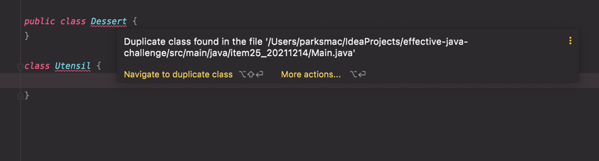

# 아이템25. 톱레벨 클래스는 한 파일에 하나만 담으라

소스 파일 하나에 톱레벨 클래스를 여러 개 선언하더라도 자바 컴파일러는 불평하지 않는다.   
하지만 아무런 이득도 없고 심각한 위험만 있는 행위다.

한 클래스를 여러 가지로 정의할 수 있으며, 그중 어느 것을 사용할지는 어느 소스 파일을 먼저 컴파일하냐에 따라 달라지기 떄문이다.

다음 소스 파일은 Main 클래스 하나를 담고 있고, Main 클래스는 다른 톱레벨 클래스 2개(Utensil 과 Dessert)를 참조한다.

```java
public class Main {
    public static void main(String[] args) {
        System.out.println(Utensil.NAME + Dessert.NAME);
    }
}

class Utensil {
    static final String NAME = "pan";
}

class Dessert {
    static final String NAME = "cake";
}
```

main 메서드의 실행 결과는 ```pancake```다.

이제 우연히 똑같은 두 클래스를 담은 Dessert.java라는 파일을 만들었다고 해보자

```java
public class Dessert {
    static final String NAME = "cake";
}

class Utensil {
    static final String NAME = "pan";
}
```

운 좋게 javac Main.java Dessert.java 명령으로 컴파일한다면 컴파일 오류가 나고 Utensil과 Dessert 클래스를 중복 정의했다고 알려줄 것이다.   
에러를 빠르게 발견할 수 있는것이다.

인텔리제이는 중복된 클래스가 있으면 컴파일 에러로 빠르게 알려준다.


하지만 javac Main.java 나 javac Main.java Utensil.java 명령으로 컴파일 하면 Dessert.java 파일을 작성하기 전처럼 pancake를 출력한다.   
그러나 javac Dessert.java Main.java 명령으로 컴파일하면 potpie를 출력한다.

> 이처럼 컴파일러에 어떤 소스 파일을 먼저 건네느냐에 따라 동작이 달라지므로 반드시 고쳐야 할 문제다.

### 해결책

단순히 톱레벨 클래스들을 서로 다른 소스 파일로 분리하면 그만이다.

```java
// Dessert.java 소스 파일
public class Dessert {
    public static final String NAME = "pan"; 
    
}

// Utensil.java 소스 파일
public class Utensil {
    public static final String NAME = "cake";

}
```

굳이 여러 톱레벨 클래스를 한 파일에 담고 싶다면 정적 멤버를 사용하는 방법을 고민해보자.

다른 클래스에 딸린 부차적인 클래스라면 정적 멤버 클래스로 만드는 쪽이 일반적으로 더 나을 것이다.

```java
public class Test {
    public static void main(String[] args) {
        System.out.println(Utensil.NAME + Dessert.NAME);
    }
    
    private static class Utensil {
        static final String NAME = "pan";
    }

    private static class Dessert {
        static final String NAME = "cake";
    }
}
```

### 핵심 정리
소스 파일 하나에는 반드시 톱레벨 클래스(혹은 톱레벨 인터페이스)를 하나만 담자.

이 규칙만 따른다면 컴파일러가 한 클래스에 대한 정의를 여러개 만들어내는 일은 사라진다.

소스 파일을 어떤 순서로 컴파일하든 파이너리 파일이나 프로그램의 동작이 달라지는 일은 결코 일어나지 않을 것이다.