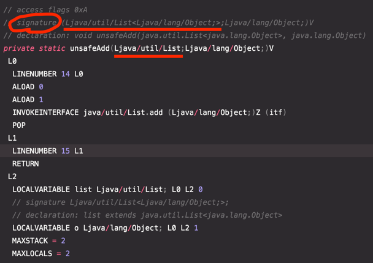

# 아이템28. 배열보다는 리스트를 사용하라

### 배열과 제네릭 타입의 차이점

배열과 제네릭 타입에는 중요한 두 가지 차이점이 있다.

### 첫 번째 차이점. 제네릭 타입은 불공변이다.
  * 배열 : Sub가 Super의 하위 타입이라면, Sub[]는 Super[]의 하위 타입이 된다.
  * 제네릭 : 서로 다른 타입 Type1과 Type2가 있을 떄, ```List<Type1>```은 ```List<Type2>```의 하위 타입도 상위 타입도 아니다.

이런 차이점은 제네릭이 문제같지만 사실 문제가 있는 쪽은 배열이다.
```java
Object[] objectArray = new Long[1];
objectArray[0] = "타입이 달라 넣을 수 없다.";
// 해당 코드는 런타임에서야 예외가 발생한다.
```

```java
List<Object> objectList = new ArrayList<Long>(); // 호환되지 않는 타입으로 컴파일 오류가 발생
ol.add("타입이 달라 넣을 수 없다.");
```

위의 두 예제 모두 예외가 발생한다. Long용 저장소에 String을 넣을 수 없는것이다.
하지만 예외가 발생하는 시점이 다르다. 

> 배열은 런타임이 되서야 예외를 알게되지만 제네릭타입은 컴파일할 때 바로 오류가 있음을 알게된다.

### 두 번째 차이점. 배열은 실체화 타입이고 제네릭 타입은 실체화 불가 타입이다.
  * 배열은 실체화 된다. 즉, 배열은 런타임에도 자신이 담기로 한 원소의 타입을 인지하고 확인한다.
  * 제네릭 타입은 타입 정보가 런타임에는 소거된다. (타입을 소거하고 필요한 곳에 형변환을 넣어주는 방식이다.)
  * 원소 타입을 컴파일 타임에만 검사하면 런타임에는 알 수 없다는 뜻이다.
  * 제네릭 타입 소거는 제네릭이 지원되기 전의 레거시 코드와 제네릭 타입을 함께 사용할 수 있게 해주는 매커니즘 이다.

아래는 실제 바이트 코드이다. 제네릭 타입을 주석으로 나타내고 실제 코드에는 제네릭이 소거된걸 볼 수 있다.


### 배열과 제네릭을 함께 사용할 때의 문제점

배열은 제네릭 타입, 매개변수화 타입, 타입 매개변수로 사용할 수 **없다.**
즉, 코드를 ```new List<E>[], new List<String>[], new E[]```식으로 작성하면 컴파일할 때 제네릭 배열 생성 오류를 일으킨다.

제네릭 배열을 만들지 못하게 막은 이유는 타입 안전하지 않기 때문이다.

```java
// 해당 코드는 컴파일 오류가 발생하는 코드다
List<String>[] stringLists = new List<String>[1];   // (1)
List<Integer> intList = List.of(42);                // (2) 
Object[] objects = stringLists;                     // (3)
objects[0] = intList;                               // (4)
String s = stringLists[0].get[0];                   // (5)
```

제네릭 배열을 생성하는 (1)이 허용한다면,    
(2)는 원소가 하나인 ```List<Integer>```를 생성한다.   
(3)은 (1)에서 생성한 ```List<String>```의 배열을 Object배열에 해당한다. 배열은 공변이니 문제가 없다.   
(4)는 (2)에서 생성한 ```List<Integer>```의 인스턴스를 Object 배열의 첫 원소로 저장한다. 제네릭은 소거 방식으로 구현되어서 성공한다.
```List<Integer>```인스턴스의 타입은 단순히 ```List```가 되고, ```List<Integer>[]``` 인스턴스의 타입은 ```List[]```가 된다.   
여기서 ```List<String>```인스턴스만 담겠다고 선언한 stringLists에 ```List<Integer>``` 인스턴스가 저장된 것에 주목하자
(5)는 이 배열의 첫 원소를 꺼내려한다. 컴파일러는 꺼낸 원소를 자동으로 String으로 형변환하는데, 이 원소는 Integer 이므로 ClassCastException이 발생한다.

> 이런 상황을 방지하기 위해 (1)의 과정처럼 제네릭 타입의 배열을 만들면 컴파일 오류가 발생한다.

```E, List<E>, List<String>```같은 타입은 실체화 불가 타입이라 한다.

실체화 되지 않아 런타임에는 컴파일타임보다 타입 정보를 적게 가진다.
(소거 매커니즘으로 인해 실체화될 수 있는 타입은 ```List<?>, Map<?, ?>```과 같은 비한정적 와일드카드 타입 뿐이다.)

### 배열을 제네릭으로 만들지 못해 불편한 경우

배열을 제네릭으로 만들 수 없어 귀찮을 때도 있다.
* 제네릭 컬렉션 에서는 자신의 원소 타입을 담은 배열을 반환하는 게 보통은 불가능 (이 문제를 해결하는 방법은 아이템 33 참고)
* 제네릭 타입과 가변인수 메서드를 함께 쓰면 해석하기 어려운 경고 메시지를 받게 된다.
  * 가변인수 메서드를 호출할 때마다 가변인수 매개변수를 담을 배열이 하나 만들어지는데, 이때 그 배열의 원소가 실체화 불가 타입이라면 경고가 발생
  * 이 문제는 @SafeVarargs 애너테이션으로 대처할 수 있다.
```java
public class Example2 {

  public static void main(String[] args) {
    List<String> strings = new ArrayList<>();
    for (int i = 0; i < 10; i++) {
      doSomething(strings);
    }
  }

  static void doSomething(List<String> ...strings) {
  }
}

// 발생하는 경고문
warning: [unchecked] Possible heap pollution from parameterized vararg type List<String>
    static void doSomething(List<String> ...strings) {
                                            ^
```

배열로 형변환할 때 제네릭 배열 생성 오류나 비검사 형변환 경고가 뜨는 경우 대부분은 배열인 E[] 대신 컬렉션인 ```List<E>```를 사용하면 해결된다.   
코드가 조금 복잡해지고 성능이 살짝 나빠질 수도 있지만, 그 대신 타입 안전성과 상호운용성은 좋아진다.

```java
public class Chooser {
    private final Object[] choiceArray;

    public Chooser(Collection choices) {
        this.choiceArray = choices.toArray();
    }
    
    public Object choose() {
        Random rnd = ThreadLocalRandom.current();
        return choiceArray[rnd.nextInt(choiceArray.length)];
    }
}
```

이 클래스의 choose() 메서드를 호출할 때 마다 반환되는 Object 인스턴스를 원하는 타입으로 형변환해야한다.   
이는 다른 타입의 원소가 들어있다면 런타임 오류가 발생할 수 있다.

다음과 같이 변경해주자
```java
public class GenericChooser<T> {
  private final T[] choiceArray;

  public GenericChooser(Collection<T> choices) {
    this.choiceArray = (T[])choices.toArray();
  }

  public Object choose() {
    Random rnd = ThreadLocalRandom.current();
    return choiceArray[rnd.nextInt(choiceArray.length)];
  }
}
```

이 코드는 정상 동작하지만 경고문이 발생한다.   
T가 무슨 타입인지 알 수 없으니 컴파일러는 이 형변환이 런타임에도 안전한지 보장할 수 없다는 메세지다.

> 제네릭에서는 원소의 타입 정보가 소거되어 런타임에는 무슨 타입인지 알 수 없음을 기억하자!

```java
warning: [unchecked] unchecked cast
        this.choiceArray = (T[])choices.toArray();
                                               ^
  required: T[]
  found:    Object[]
  where T is a type-variable:
    T extends Object declared in class GenericChooser
```

이 경고를 해결하는 방법은 이 코드가 안전하다고 100% 확신하면 안전하다고 하는 이유를 주석으로 남기고 @SuppressWarnings를 달아 경고를 숨길 수 있다.

> 하지만 경고의 원인을 제거하는 편이 훨씬 낫다.

```java
public class GenericChooser2<T> {
    private final List<T> choiceList;

    public GenericChooser2(Collection<T> choices) {
        this.choiceList = new ArrayList<>(choices); // 방어적 복사
    }

    public Object choose() {
        Random rnd = ThreadLocalRandom.current();
        return choiceList.get(rnd.nextInt(choiceList.size()));
    }
}
```

코드양이 조금 늘었고 성능은 약간 떨어지지만, 런타임에 ClassCastException을 만날 일은 없으니 그만한 가치가 있다.

### 핵심 정리
배열과 제네릭에는 매우 다른 타입 규칙이 적용된다.
* 배열은 공변이고 실체화 타입
* 제네릭은 불공변이고 타입 정보가 소거된다.
* 배열은 런타임에는 타입 안전하지만 컴파일타임에는 그렇지 않다.
* 제네릭은 런타임에 타입이 불안전하지만 컴파일타임에 타입 안전하다.
* 위 차이점으로 인해 둘을 섞어 쓰기란 쉽지 않다.

> 둘을 섞어 쓰다가 컴파일 오류나 경고를 만나면, 가장 먼저 배열을 리스트로 대체하는 방법을 적용해보자.